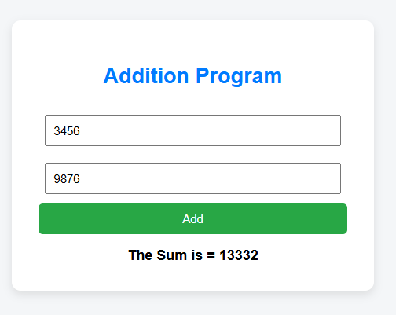
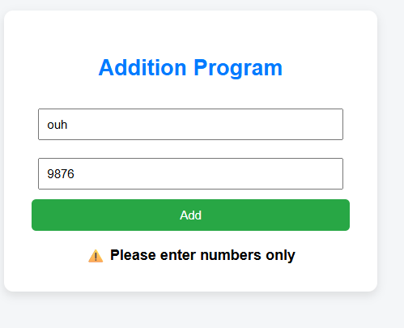
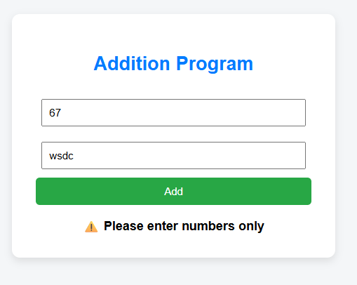

# 🔢 JavaScript Addition Program

## 📌 Project Overview

This project is a simple and interactive web application built using **JavaScript** that performs the addition of two numbers entered by the user.

It also includes **input validation** to ensure that only numeric values are accepted. If invalid input is provided, an error message is displayed to guide the user.

---

## 🚀 Features

* ✔ User-friendly interface
* ✔ Real-time input validation
* ✔ Dynamic result display
* ✔ Error handling for invalid inputs

---

## 🛠️ Technologies Used

* HTML5
* JavaScript (ES6)
* DOM Manipulation

---

## ⚙️ How It Works

1. The user enters two values in the input fields.
2. Clicks the **Add** button.
3. The `validation()` function checks if inputs are numeric.
4. If invalid → displays an error message.
5. If valid → the `addition()` function calculates the sum.
6. The result is displayed instantly on the webpage.

---

## 📁 Project Structure

```
JavaScript-Addition-Program/
│
├── addition.html
├── README.md
└── images/
    ├── result.png
    ├── invalid_input1.png
    └── invalid_input2.png
```

---

## 🧠 Core Logic

### Validation Function

```javascript
function validation() {
    let number1 = parseInt(document.getElementById("number1").value);
    let number2 = parseInt(document.getElementById("number2").value);

    if (isNaN(number1) || isNaN(number2)) {
        document.getElementById("result_id").innerHTML = "⚠️ Please enter numbers only";
    } else {
        addition();
    }
}
```

### Addition Function

```javascript
function addition() {
    let number1 = parseInt(document.getElementById("number1").value);
    let number2 = parseInt(document.getElementById("number2").value);

    let sum = number1 + number2;

    document.getElementById("result_id").innerHTML = "The Sum is = " + sum;
}
```

---

## 🖼️ Output Screens

### ✔ Addition Result



### ❌ Invalid Input (First Number)



### ❌ Invalid Input (Second Number)



---

## 👩‍💻 Author

**Sathvika Gatla**

---

## ⭐ Acknowledgment

This project is created for learning and practicing basic JavaScript concepts including DOM manipulation and input validation.
